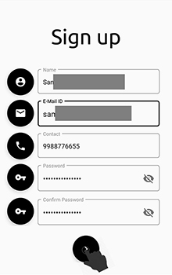
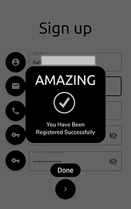

# VAFFi - Voicce Assisted Form Filling
### by Team ID : FT-193984

## About the Project

This project is aimed at developing and deploying speech interface for form-filling application which replaces the traditional keyboard for entering the responses. The VAFFi system interacts with the user via voice interaction the user can interact with the system in  language provided by the android system settings, in order to fill the responses. The VAFFi system prompts the user with android RecogIntent system pop-up, recognizes the user responses, and fills the form. We propose to develop modular framework for filling different fields in the forms, like name, address, date of birth etc., each of which may in turn involve several subfields, so that it can be easily deployed across the domains including, but not limited to, healthcare, education, governance, banking, etc. Since the proposed system is based purely on speech communication, it can help in taking the fruits of modern digitization techniques to the rural public.

The purpose of this project is to develop an Android application, which provides the voice recognition services. The system’s main target user is those people with Android phone, who want to fill some application form through his/her phone but are suffering from some kind of difficulty like, language barriers. This system will help the users for filling application forms by speaking to the device; it will bring the convenience to the user.

The development language use to develop the voice recognition system is Java programming language. The software involves major are the Android software development kit, Firebase Service Libraries,  Android Studio IDE. At the end of this project, there will an Android application which using the offline voice recognition system (Voice Recognition API by Google). VAFFi is able to receive the user voice as input and identify the phase then the voice system will write that phase in the specific data column, if an invalid data is filled in a column then the application will prompt an error message to the user as well as error voice output to the user.

### Prerequisites :-

* Android device with well configured Text-To-Speech Engine
* Android  version between Marshmallow(6.x) - Pie(9.x)
* Working internet connection on the device

### How to use the application

* Select

Select a From Option from the available ones.

* Input Data

After selecting a form click the floating button on the left of each column to fill the data in that column. Clicking on button will prompt a pop-up of RecogIntent at that time just says only the value/data you want to put in that column.

* Validate

If any invalid data is put in any column the system will prompt for that invalid value just correct that and look for any other invalid or incorrect data.

* Confirm Submission

After your validation gets completed just click the submit floating button at the bottem of the form to make final submittion.

* Done

After clicking the submit button as the submission gets completed by the system it will prompt a "Submission Complete" message card on the screen.

### Add-On

The System uses Firebase to store the data you fill in the form, in order to use the same for futher operations or for checking wheather a same data value already exist in the database or not to avoid multiple submission of same form or data duplication. For Example: Sign up form and Login form both utilises same database, the user who register themselves using the signup form can check by login in with the registered email id/contact and password. If login gets successful the system will prompt a logged in popup else it will throw a error voice message of "User does not exist".

Also, system enables Keboard Focus for some columns where there might be chances that data filled can be incorrect due to pronunciation error or casing mistakes or situation where user don't want to say that particlular data in public like passwords, ATM pins, etc.

### NOTE

This Application is not a complete fully functional application. It just demonstrates the basic ideological concept of "ZERO TYPING DATA ENTRY" and only includes the basic operational activities. 
